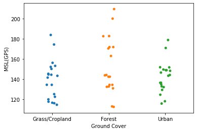

```python
file = open("Wabash_CVA_NAD83_passed.csv")
```

    <_io.TextIOWrapper name='Wabash_CVA_NAD83_passed.csv' mode='r' encoding='cp1252'>
    


```python
import seaborn as sns
%matplotlib inline
```


```python
import pandas as pd
```


```python
import pandas as pd 
# Read data from file 'filename.csv' 
# (in the same directory that your python process is based)
# Control delimiters, rows, column names with read_csv (see later) 
data = pd.read_csv("Wabash_CVA_NAD83_passed.csv") 
# Preview the first 5 lines of the loaded data 
data.head()
```


<div>
<style scoped>
    .dataframe tbody tr th:only-of-type {
        vertical-align: middle;
    }

    .dataframe tbody tr th {
        vertical-align: top;
    }

    .dataframe thead th {
        text-align: right;
    }
</style>
<table border="1" class="dataframe">
  <thead>
    <tr style="text-align: right;">
      <th></th>
      <th>CVA</th>
      <th>Ground Cover</th>
      <th>Latitude</th>
      <th>Longitude</th>
      <th>Northing</th>
      <th>Easting</th>
      <th>HAE(GPS)</th>
      <th>Geoid09</th>
      <th>MSL(GPS)</th>
      <th>MSL(LiDAR)</th>
      <th>? Z</th>
      <th>? Z2</th>
      <th>Unnamed: 12</th>
    </tr>
  </thead>
  <tbody>
    <tr>
      <th>0</th>
      <td>WAB421</td>
      <td>Grass/Cropland</td>
      <td>38.263224</td>
      <td>-88.026189</td>
      <td>4235518.88</td>
      <td>410225.20</td>
      <td>91.49</td>
      <td>-30.80</td>
      <td>122.30</td>
      <td>122.39</td>
      <td>-0.09</td>
      <td>0.01</td>
      <td>0.09</td>
    </tr>
    <tr>
      <th>1</th>
      <td>WAB422</td>
      <td>Grass/Cropland</td>
      <td>38.249882</td>
      <td>-87.996517</td>
      <td>4234009.96</td>
      <td>412805.17</td>
      <td>103.35</td>
      <td>-30.84</td>
      <td>134.19</td>
      <td>134.37</td>
      <td>-0.18</td>
      <td>0.03</td>
      <td>0.18</td>
    </tr>
    <tr>
      <th>2</th>
      <td>WAB423</td>
      <td>Grass/Cropland</td>
      <td>38.187911</td>
      <td>-87.918953</td>
      <td>4227063.43</td>
      <td>419523.84</td>
      <td>83.48</td>
      <td>-30.90</td>
      <td>114.38</td>
      <td>114.48</td>
      <td>-0.10</td>
      <td>0.01</td>
      <td>0.10</td>
    </tr>
    <tr>
      <th>3</th>
      <td>WAB424</td>
      <td>Grass/Cropland</td>
      <td>38.167400</td>
      <td>-87.907195</td>
      <td>4224777.45</td>
      <td>420531.27</td>
      <td>85.02</td>
      <td>-30.89</td>
      <td>115.91</td>
      <td>115.85</td>
      <td>0.06</td>
      <td>0.00</td>
      <td>0.06</td>
    </tr>
    <tr>
      <th>4</th>
      <td>WAB425</td>
      <td>Grass/Cropland</td>
      <td>37.924153</td>
      <td>-87.962924</td>
      <td>4197836.81</td>
      <td>415369.88</td>
      <td>86.99</td>
      <td>-30.45</td>
      <td>117.44</td>
      <td>117.48</td>
      <td>-0.04</td>
      <td>0.00</td>
      <td>0.04</td>
    </tr>
  </tbody>
</table>
</div>


```python
data
```


<div>
<style scoped>
    .dataframe tbody tr th:only-of-type {
        vertical-align: middle;
    }

    .dataframe tbody tr th {
        vertical-align: top;
    }

    .dataframe thead th {
        text-align: right;
    }
</style>
<table border="1" class="dataframe">
  <thead>
    <tr style="text-align: right;">
      <th></th>
      <th>CVA</th>
      <th>Ground Cover</th>
      <th>Latitude</th>
      <th>Longitude</th>
      <th>Northing</th>
      <th>Easting</th>
      <th>HAE(GPS)</th>
      <th>Geoid09</th>
      <th>MSL(GPS)</th>
      <th>MSL(LiDAR)</th>
      <th>? Z</th>
      <th>? Z2</th>
      <th>Unnamed: 12</th>
    </tr>
  </thead>
  <tbody>
    <tr>
      <th>0</th>
      <td>WAB421</td>
      <td>Grass/Cropland</td>
      <td>38.263224</td>
      <td>-88.026189</td>
      <td>4235518.88</td>
      <td>410225.20</td>
      <td>91.49</td>
      <td>-30.80</td>
      <td>122.30</td>
      <td>122.39</td>
      <td>-0.09</td>
      <td>0.01</td>
      <td>0.09</td>
    </tr>
    <tr>
      <th>1</th>
      <td>WAB422</td>
      <td>Grass/Cropland</td>
      <td>38.249882</td>
      <td>-87.996517</td>
      <td>4234009.96</td>
      <td>412805.17</td>
      <td>103.35</td>
      <td>-30.84</td>
      <td>134.19</td>
      <td>134.37</td>
      <td>-0.18</td>
      <td>0.03</td>
      <td>0.18</td>
    </tr>
    <tr>
      <th>2</th>
      <td>WAB423</td>
      <td>Grass/Cropland</td>
      <td>38.187911</td>
      <td>-87.918953</td>
      <td>4227063.43</td>
      <td>419523.84</td>
      <td>83.48</td>
      <td>-30.90</td>
      <td>114.38</td>
      <td>114.48</td>
      <td>-0.10</td>
      <td>0.01</td>
      <td>0.10</td>
    </tr>
    <tr>
      <th>3</th>
      <td>WAB424</td>
      <td>Grass/Cropland</td>
      <td>38.167400</td>
      <td>-87.907195</td>
      <td>4224777.45</td>
      <td>420531.27</td>
      <td>85.02</td>
      <td>-30.89</td>
      <td>115.91</td>
      <td>115.85</td>
      <td>0.06</td>
      <td>0.00</td>
      <td>0.06</td>
    </tr>
    <tr>
      <th>4</th>
      <td>WAB425</td>
      <td>Grass/Cropland</td>
      <td>37.924153</td>
      <td>-87.962924</td>
      <td>4197836.81</td>
      <td>415369.88</td>
      <td>86.99</td>
      <td>-30.45</td>
      <td>117.44</td>
      <td>117.48</td>
      <td>-0.04</td>
      <td>0.00</td>
      <td>0.04</td>
    </tr>
    <tr>
      <th>5</th>
      <td>WAB426</td>
      <td>Grass/Cropland</td>
      <td>37.897312</td>
      <td>-87.944830</td>
      <td>4194842.38</td>
      <td>416929.98</td>
      <td>85.95</td>
      <td>-30.43</td>
      <td>116.38</td>
      <td>116.32</td>
      <td>0.06</td>
      <td>0.00</td>
      <td>0.06</td>
    </tr>
    <tr>
      <th>6</th>
      <td>WAB427</td>
      <td>Grass/Cropland</td>
      <td>38.393193</td>
      <td>-87.748823</td>
      <td>4249707.49</td>
      <td>434607.53</td>
      <td>88.46</td>
      <td>-31.27</td>
      <td>119.73</td>
      <td>119.87</td>
      <td>-0.14</td>
      <td>0.02</td>
      <td>0.14</td>
    </tr>
    <tr>
      <th>7</th>
      <td>WAB428</td>
      <td>Grass/Cropland</td>
      <td>38.650579</td>
      <td>-87.493458</td>
      <td>4278117.59</td>
      <td>457061.16</td>
      <td>120.24</td>
      <td>-31.79</td>
      <td>152.03</td>
      <td>152.15</td>
      <td>-0.13</td>
      <td>0.02</td>
      <td>0.13</td>
    </tr>
    <tr>
      <th>8</th>
      <td>WAB429</td>
      <td>Grass/Cropland</td>
      <td>38.687867</td>
      <td>-87.492836</td>
      <td>4282255.03</td>
      <td>457137.45</td>
      <td>102.42</td>
      <td>-31.82</td>
      <td>134.24</td>
      <td>134.29</td>
      <td>-0.05</td>
      <td>0.00</td>
      <td>0.05</td>
    </tr>
    <tr>
      <th>9</th>
      <td>WAB430</td>
      <td>Grass/Cropland</td>
      <td>38.745476</td>
      <td>-87.556900</td>
      <td>4288679.65</td>
      <td>451604.57</td>
      <td>93.17</td>
      <td>-31.77</td>
      <td>124.94</td>
      <td>124.90</td>
      <td>0.04</td>
      <td>0.00</td>
      <td>0.04</td>
    </tr>
    <tr>
      <th>10</th>
      <td>WAB431</td>
      <td>Grass/Cropland</td>
      <td>39.423392</td>
      <td>-87.432902</td>
      <td>4363852.01</td>
      <td>462738.65</td>
      <td>117.41</td>
      <td>-32.60</td>
      <td>150.01</td>
      <td>150.18</td>
      <td>-0.17</td>
      <td>0.03</td>
      <td>0.17</td>
    </tr>
    <tr>
      <th>11</th>
      <td>WAB432</td>
      <td>Grass/Cropland</td>
      <td>39.469215</td>
      <td>-87.441038</td>
      <td>4368940.77</td>
      <td>462063.21</td>
      <td>111.62</td>
      <td>-32.62</td>
      <td>144.24</td>
      <td>144.37</td>
      <td>-0.13</td>
      <td>0.02</td>
      <td>0.13</td>
    </tr>
    <tr>
      <th>12</th>
      <td>WAB433</td>
      <td>Grass/Cropland</td>
      <td>39.559117</td>
      <td>-87.369726</td>
      <td>4378890.63</td>
      <td>468238.23</td>
      <td>120.27</td>
      <td>-32.80</td>
      <td>153.07</td>
      <td>153.15</td>
      <td>-0.08</td>
      <td>0.01</td>
      <td>0.08</td>
    </tr>
    <tr>
      <th>13</th>
      <td>WAB434</td>
      <td>Grass/Cropland</td>
      <td>39.593286</td>
      <td>-87.368618</td>
      <td>4382682.43</td>
      <td>468348.93</td>
      <td>123.28</td>
      <td>-32.82</td>
      <td>156.10</td>
      <td>156.11</td>
      <td>-0.01</td>
      <td>0.00</td>
      <td>0.01</td>
    </tr>
    <tr>
      <th>14</th>
      <td>WAB435</td>
      <td>Grass/Cropland</td>
      <td>39.680893</td>
      <td>-87.363628</td>
      <td>4392403.66</td>
      <td>468816.77</td>
      <td>111.59</td>
      <td>-32.88</td>
      <td>144.47</td>
      <td>144.51</td>
      <td>-0.04</td>
      <td>0.00</td>
      <td>0.04</td>
    </tr>
    <tr>
      <th>15</th>
      <td>WAB436</td>
      <td>Grass/Cropland</td>
      <td>39.660506</td>
      <td>-87.384379</td>
      <td>4390148.46</td>
      <td>467027.59</td>
      <td>108.55</td>
      <td>-32.83</td>
      <td>141.37</td>
      <td>141.54</td>
      <td>-0.17</td>
      <td>0.03</td>
      <td>0.17</td>
    </tr>
    <tr>
      <th>16</th>
      <td>WAB437</td>
      <td>Grass/Cropland</td>
      <td>39.622149</td>
      <td>-87.502441</td>
      <td>4385941.46</td>
      <td>456876.22</td>
      <td>151.29</td>
      <td>-32.51</td>
      <td>183.80</td>
      <td>184.07</td>
      <td>-0.27</td>
      <td>0.07</td>
      <td>0.27</td>
    </tr>
    <tr>
      <th>17</th>
      <td>WAB438</td>
      <td>Grass/Cropland</td>
      <td>39.508015</td>
      <td>-87.290857</td>
      <td>4373194.42</td>
      <td>474995.25</td>
      <td>141.44</td>
      <td>-32.86</td>
      <td>174.30</td>
      <td>174.55</td>
      <td>-0.25</td>
      <td>0.06</td>
      <td>0.25</td>
    </tr>
    <tr>
      <th>18</th>
      <td>WAB439</td>
      <td>Grass/Cropland</td>
      <td>39.371122</td>
      <td>-87.473206</td>
      <td>4358068.44</td>
      <td>459239.06</td>
      <td>112.73</td>
      <td>-32.49</td>
      <td>145.22</td>
      <td>145.30</td>
      <td>-0.08</td>
      <td>0.01</td>
      <td>0.08</td>
    </tr>
    <tr>
      <th>19</th>
      <td>WAB440</td>
      <td>Grass/Cropland</td>
      <td>39.114134</td>
      <td>-87.675127</td>
      <td>4329659.17</td>
      <td>441633.37</td>
      <td>111.19</td>
      <td>-31.99</td>
      <td>143.17</td>
      <td>143.31</td>
      <td>-0.14</td>
      <td>0.02</td>
      <td>0.14</td>
    </tr>
    <tr>
      <th>20</th>
      <td>WAB721</td>
      <td>Forest</td>
      <td>38.157112</td>
      <td>-87.907258</td>
      <td>4223636.03</td>
      <td>420514.65</td>
      <td>81.84</td>
      <td>-30.88</td>
      <td>112.72</td>
      <td>112.19</td>
      <td>0.53</td>
      <td>0.28</td>
      <td>0.53</td>
    </tr>
    <tr>
      <th>21</th>
      <td>WAB722</td>
      <td>Forest</td>
      <td>38.157108</td>
      <td>-87.906554</td>
      <td>4223634.97</td>
      <td>420576.27</td>
      <td>81.38</td>
      <td>-30.88</td>
      <td>112.25</td>
      <td>112.19</td>
      <td>0.06</td>
      <td>0.00</td>
      <td>0.06</td>
    </tr>
    <tr>
      <th>22</th>
      <td>WAB723</td>
      <td>Forest</td>
      <td>38.116943</td>
      <td>-87.918575</td>
      <td>4219188.70</td>
      <td>419479.02</td>
      <td>132.12</td>
      <td>-30.80</td>
      <td>162.91</td>
      <td>162.90</td>
      <td>0.01</td>
      <td>0.00</td>
      <td>0.01</td>
    </tr>
    <tr>
      <th>23</th>
      <td>WAB724</td>
      <td>Forest</td>
      <td>38.111112</td>
      <td>-87.779233</td>
      <td>4218429.94</td>
      <td>431688.29</td>
      <td>101.25</td>
      <td>-30.95</td>
      <td>132.20</td>
      <td>132.40</td>
      <td>-0.20</td>
      <td>0.04</td>
      <td>0.20</td>
    </tr>
    <tr>
      <th>24</th>
      <td>WAB725</td>
      <td>Forest</td>
      <td>38.111153</td>
      <td>-87.779632</td>
      <td>4218434.82</td>
      <td>431653.33</td>
      <td>101.56</td>
      <td>-30.95</td>
      <td>132.51</td>
      <td>132.71</td>
      <td>-0.20</td>
      <td>0.04</td>
      <td>0.20</td>
    </tr>
    <tr>
      <th>25</th>
      <td>WAB726</td>
      <td>Forest</td>
      <td>38.687383</td>
      <td>-87.493440</td>
      <td>4282201.57</td>
      <td>457084.64</td>
      <td>102.32</td>
      <td>-31.82</td>
      <td>134.14</td>
      <td>134.33</td>
      <td>-0.19</td>
      <td>0.04</td>
      <td>0.19</td>
    </tr>
    <tr>
      <th>26</th>
      <td>WAB727</td>
      <td>Forest</td>
      <td>38.685987</td>
      <td>-87.502294</td>
      <td>4282050.83</td>
      <td>456313.80</td>
      <td>98.89</td>
      <td>-31.80</td>
      <td>130.70</td>
      <td>130.67</td>
      <td>0.03</td>
      <td>0.00</td>
      <td>0.03</td>
    </tr>
    <tr>
      <th>27</th>
      <td>WAB728</td>
      <td>Forest</td>
      <td>39.448613</td>
      <td>-87.337860</td>
      <td>4366616.02</td>
      <td>470929.74</td>
      <td>137.65</td>
      <td>-32.74</td>
      <td>170.39</td>
      <td>170.57</td>
      <td>-0.19</td>
      <td>0.03</td>
      <td>0.19</td>
    </tr>
    <tr>
      <th>28</th>
      <td>WAB729</td>
      <td>Forest</td>
      <td>39.452380</td>
      <td>-87.464760</td>
      <td>4367082.67</td>
      <td>460013.05</td>
      <td>111.08</td>
      <td>-32.57</td>
      <td>143.65</td>
      <td>143.64</td>
      <td>0.01</td>
      <td>0.00</td>
      <td>0.01</td>
    </tr>
    <tr>
      <th>29</th>
      <td>WAB730</td>
      <td>Forest</td>
      <td>39.361628</td>
      <td>-87.401552</td>
      <td>4356984.95</td>
      <td>465406.51</td>
      <td>139.22</td>
      <td>-32.55</td>
      <td>171.77</td>
      <td>171.87</td>
      <td>-0.10</td>
      <td>0.01</td>
      <td>0.10</td>
    </tr>
    <tr>
      <th>30</th>
      <td>WAB731</td>
      <td>Forest</td>
      <td>39.637926</td>
      <td>-87.356593</td>
      <td>4387632.52</td>
      <td>469401.11</td>
      <td>167.19</td>
      <td>-32.87</td>
      <td>200.06</td>
      <td>200.00</td>
      <td>0.06</td>
      <td>0.00</td>
      <td>0.06</td>
    </tr>
    <tr>
      <th>31</th>
      <td>WAB732</td>
      <td>Forest</td>
      <td>39.685989</td>
      <td>-87.398454</td>
      <td>4392981.93</td>
      <td>465832.76</td>
      <td>111.18</td>
      <td>-32.81</td>
      <td>143.98</td>
      <td>144.09</td>
      <td>-0.11</td>
      <td>0.01</td>
      <td>0.11</td>
    </tr>
    <tr>
      <th>32</th>
      <td>WAB733</td>
      <td>Forest</td>
      <td>39.565868</td>
      <td>-87.452890</td>
      <td>4379672.57</td>
      <td>461097.68</td>
      <td>149.93</td>
      <td>-32.63</td>
      <td>182.56</td>
      <td>182.45</td>
      <td>0.11</td>
      <td>0.01</td>
      <td>0.11</td>
    </tr>
    <tr>
      <th>33</th>
      <td>WAB734</td>
      <td>Forest</td>
      <td>39.547119</td>
      <td>-87.452481</td>
      <td>4377591.62</td>
      <td>461122.29</td>
      <td>150.08</td>
      <td>-32.63</td>
      <td>182.71</td>
      <td>182.85</td>
      <td>-0.14</td>
      <td>0.02</td>
      <td>0.14</td>
    </tr>
    <tr>
      <th>34</th>
      <td>WAB735</td>
      <td>Forest</td>
      <td>39.390456</td>
      <td>-87.310265</td>
      <td>4360153.22</td>
      <td>473281.90</td>
      <td>139.03</td>
      <td>-32.68</td>
      <td>171.72</td>
      <td>171.80</td>
      <td>-0.08</td>
      <td>0.01</td>
      <td>0.08</td>
    </tr>
    <tr>
      <th>35</th>
      <td>WAB736</td>
      <td>Forest</td>
      <td>38.687383</td>
      <td>-87.493440</td>
      <td>4282201.54</td>
      <td>457084.67</td>
      <td>102.37</td>
      <td>-31.82</td>
      <td>134.18</td>
      <td>134.33</td>
      <td>-0.15</td>
      <td>0.02</td>
      <td>0.15</td>
    </tr>
    <tr>
      <th>36</th>
      <td>WAB737</td>
      <td>Forest</td>
      <td>39.606012</td>
      <td>-87.119484</td>
      <td>4384036.69</td>
      <td>489742.54</td>
      <td>176.49</td>
      <td>-33.07</td>
      <td>209.56</td>
      <td>209.46</td>
      <td>0.10</td>
      <td>0.01</td>
      <td>0.10</td>
    </tr>
    <tr>
      <th>37</th>
      <td>WAB738</td>
      <td>Forest</td>
      <td>39.339952</td>
      <td>-87.496900</td>
      <td>4354620.24</td>
      <td>457179.07</td>
      <td>109.81</td>
      <td>-32.43</td>
      <td>142.25</td>
      <td>142.33</td>
      <td>-0.08</td>
      <td>0.01</td>
      <td>0.08</td>
    </tr>
    <tr>
      <th>38</th>
      <td>WAB739</td>
      <td>Forest</td>
      <td>39.114022</td>
      <td>-87.674452</td>
      <td>4329646.40</td>
      <td>441691.56</td>
      <td>110.27</td>
      <td>-31.99</td>
      <td>142.25</td>
      <td>142.33</td>
      <td>-0.08</td>
      <td>0.01</td>
      <td>0.08</td>
    </tr>
    <tr>
      <th>39</th>
      <td>WAB811</td>
      <td>Urban</td>
      <td>38.257034</td>
      <td>-87.995156</td>
      <td>4234802.35</td>
      <td>412932.80</td>
      <td>105.46</td>
      <td>-30.85</td>
      <td>136.31</td>
      <td>136.40</td>
      <td>-0.09</td>
      <td>0.01</td>
      <td>0.09</td>
    </tr>
    <tr>
      <th>40</th>
      <td>WAB812</td>
      <td>Urban</td>
      <td>38.258126</td>
      <td>-88.004126</td>
      <td>4234932.01</td>
      <td>412149.24</td>
      <td>112.40</td>
      <td>-30.83</td>
      <td>143.23</td>
      <td>143.32</td>
      <td>-0.09</td>
      <td>0.01</td>
      <td>0.09</td>
    </tr>
    <tr>
      <th>41</th>
      <td>WAB813</td>
      <td>Urban</td>
      <td>37.941437</td>
      <td>-87.896520</td>
      <td>4199696.27</td>
      <td>421224.58</td>
      <td>102.15</td>
      <td>-30.55</td>
      <td>132.70</td>
      <td>132.66</td>
      <td>0.04</td>
      <td>0.00</td>
      <td>0.04</td>
    </tr>
    <tr>
      <th>42</th>
      <td>WAB814</td>
      <td>Urban</td>
      <td>37.929915</td>
      <td>-87.903563</td>
      <td>4198423.90</td>
      <td>420593.37</td>
      <td>87.34</td>
      <td>-30.52</td>
      <td>117.86</td>
      <td>117.70</td>
      <td>0.16</td>
      <td>0.03</td>
      <td>0.16</td>
    </tr>
    <tr>
      <th>43</th>
      <td>WAB815</td>
      <td>Urban</td>
      <td>37.934358</td>
      <td>-87.885554</td>
      <td>4198901.70</td>
      <td>422180.66</td>
      <td>85.03</td>
      <td>-30.55</td>
      <td>115.58</td>
      <td>115.54</td>
      <td>0.04</td>
      <td>0.00</td>
      <td>0.04</td>
    </tr>
    <tr>
      <th>44</th>
      <td>WAB816</td>
      <td>Urban</td>
      <td>38.102079</td>
      <td>-87.786126</td>
      <td>4217432.75</td>
      <td>431075.52</td>
      <td>115.47</td>
      <td>-30.93</td>
      <td>146.40</td>
      <td>146.41</td>
      <td>-0.01</td>
      <td>0.00</td>
      <td>0.01</td>
    </tr>
    <tr>
      <th>45</th>
      <td>WAB817</td>
      <td>Urban</td>
      <td>38.410595</td>
      <td>-87.782988</td>
      <td>4251663.19</td>
      <td>431640.33</td>
      <td>93.13</td>
      <td>-31.23</td>
      <td>124.37</td>
      <td>124.37</td>
      <td>-0.01</td>
      <td>0.00</td>
      <td>0.01</td>
    </tr>
    <tr>
      <th>46</th>
      <td>WAB818</td>
      <td>Urban</td>
      <td>38.416790</td>
      <td>-87.764988</td>
      <td>4252337.36</td>
      <td>433217.52</td>
      <td>100.66</td>
      <td>-31.25</td>
      <td>131.91</td>
      <td>131.91</td>
      <td>0.00</td>
      <td>0.00</td>
      <td>0.00</td>
    </tr>
    <tr>
      <th>47</th>
      <td>WAB819</td>
      <td>Urban</td>
      <td>38.404460</td>
      <td>-87.772408</td>
      <td>4250974.63</td>
      <td>432558.29</td>
      <td>97.93</td>
      <td>-31.24</td>
      <td>129.17</td>
      <td>129.17</td>
      <td>0.00</td>
      <td>0.00</td>
      <td>0.00</td>
    </tr>
    <tr>
      <th>48</th>
      <td>WAB820</td>
      <td>Urban</td>
      <td>38.687706</td>
      <td>-87.493601</td>
      <td>4282237.49</td>
      <td>457070.88</td>
      <td>102.86</td>
      <td>-31.82</td>
      <td>134.68</td>
      <td>134.64</td>
      <td>0.04</td>
      <td>0.00</td>
      <td>0.04</td>
    </tr>
    <tr>
      <th>49</th>
      <td>WAB821</td>
      <td>Urban</td>
      <td>38.759591</td>
      <td>-87.415769</td>
      <td>4290180.72</td>
      <td>463876.22</td>
      <td>138.87</td>
      <td>-31.98</td>
      <td>170.85</td>
      <td>170.90</td>
      <td>-0.05</td>
      <td>0.00</td>
      <td>0.05</td>
    </tr>
    <tr>
      <th>50</th>
      <td>WAB822</td>
      <td>Urban</td>
      <td>39.472978</td>
      <td>-87.382790</td>
      <td>4369335.49</td>
      <td>467075.34</td>
      <td>116.07</td>
      <td>-32.71</td>
      <td>148.78</td>
      <td>148.96</td>
      <td>-0.18</td>
      <td>0.03</td>
      <td>0.18</td>
    </tr>
    <tr>
      <th>51</th>
      <td>WAB823</td>
      <td>Urban</td>
      <td>39.465018</td>
      <td>-87.451742</td>
      <td>4368479.61</td>
      <td>461140.16</td>
      <td>111.42</td>
      <td>-32.60</td>
      <td>144.02</td>
      <td>144.06</td>
      <td>-0.04</td>
      <td>0.00</td>
      <td>0.04</td>
    </tr>
    <tr>
      <th>52</th>
      <td>WAB824</td>
      <td>Urban</td>
      <td>39.448434</td>
      <td>-87.397968</td>
      <td>4366617.25</td>
      <td>465757.78</td>
      <td>115.49</td>
      <td>-32.67</td>
      <td>148.15</td>
      <td>148.11</td>
      <td>0.04</td>
      <td>0.00</td>
      <td>0.04</td>
    </tr>
    <tr>
      <th>53</th>
      <td>WAB825</td>
      <td>Urban</td>
      <td>39.492447</td>
      <td>-87.398981</td>
      <td>4371502.22</td>
      <td>465692.23</td>
      <td>116.72</td>
      <td>-32.71</td>
      <td>149.42</td>
      <td>149.37</td>
      <td>0.05</td>
      <td>0.00</td>
      <td>0.05</td>
    </tr>
    <tr>
      <th>54</th>
      <td>WAB826</td>
      <td>Urban</td>
      <td>39.523474</td>
      <td>-87.371959</td>
      <td>4374935.68</td>
      <td>468030.08</td>
      <td>116.01</td>
      <td>-32.77</td>
      <td>148.78</td>
      <td>148.80</td>
      <td>-0.02</td>
      <td>0.00</td>
      <td>0.02</td>
    </tr>
    <tr>
      <th>55</th>
      <td>WAB827</td>
      <td>Urban</td>
      <td>39.658831</td>
      <td>-87.398879</td>
      <td>4389967.98</td>
      <td>465782.88</td>
      <td>118.77</td>
      <td>-32.79</td>
      <td>151.57</td>
      <td>151.46</td>
      <td>0.10</td>
      <td>0.01</td>
      <td>0.10</td>
    </tr>
    <tr>
      <th>56</th>
      <td>WAB828</td>
      <td>Urban</td>
      <td>39.493689</td>
      <td>-87.266949</td>
      <td>4371598.17</td>
      <td>477045.88</td>
      <td>145.91</td>
      <td>-32.87</td>
      <td>178.78</td>
      <td>178.94</td>
      <td>-0.16</td>
      <td>0.03</td>
      <td>0.16</td>
    </tr>
    <tr>
      <th>57</th>
      <td>WAB829</td>
      <td>Urban</td>
      <td>39.107341</td>
      <td>-87.664953</td>
      <td>4328898.93</td>
      <td>442507.38</td>
      <td>119.71</td>
      <td>-31.99</td>
      <td>151.69</td>
      <td>151.72</td>
      <td>-0.03</td>
      <td>0.00</td>
      <td>0.03</td>
    </tr>
    <tr>
      <th>58</th>
      <td>WAB830</td>
      <td>Urban</td>
      <td>39.109445</td>
      <td>-87.656940</td>
      <td>4329127.33</td>
      <td>443201.88</td>
      <td>104.26</td>
      <td>-32.00</td>
      <td>136.26</td>
      <td>136.39</td>
      <td>-0.13</td>
      <td>0.02</td>
      <td>0.13</td>
    </tr>
    <tr>
      <th>59</th>
      <td>NaN</td>
      <td>NaN</td>
      <td>NaN</td>
      <td>NaN</td>
      <td>NaN</td>
      <td>NaN</td>
      <td>NaN</td>
      <td>NaN</td>
      <td>NaN</td>
      <td>NaN</td>
      <td>NaN</td>
      <td>NaN</td>
      <td>0.10</td>
    </tr>
  </tbody>
</table>
</div>


```python
data.drop([59],inplace = True)
```


```python
data
```


<div>
<style scoped>
    .dataframe tbody tr th:only-of-type {
        vertical-align: middle;
    }

    .dataframe tbody tr th {
        vertical-align: top;
    }

    .dataframe thead th {
        text-align: right;
    }
</style>
<table border="1" class="dataframe">
  <thead>
    <tr style="text-align: right;">
      <th></th>
      <th>CVA</th>
      <th>Ground Cover</th>
      <th>Latitude</th>
      <th>Longitude</th>
      <th>Northing</th>
      <th>Easting</th>
      <th>HAE(GPS)</th>
      <th>Geoid09</th>
      <th>MSL(GPS)</th>
      <th>MSL(LiDAR)</th>
      <th>? Z</th>
      <th>? Z2</th>
      <th>Unnamed: 12</th>
    </tr>
  </thead>
  <tbody>
    <tr>
      <th>0</th>
      <td>WAB421</td>
      <td>Grass/Cropland</td>
      <td>38.263224</td>
      <td>-88.026189</td>
      <td>4235518.88</td>
      <td>410225.20</td>
      <td>91.49</td>
      <td>-30.80</td>
      <td>122.30</td>
      <td>122.39</td>
      <td>-0.09</td>
      <td>0.01</td>
      <td>0.09</td>
    </tr>
    <tr>
      <th>1</th>
      <td>WAB422</td>
      <td>Grass/Cropland</td>
      <td>38.249882</td>
      <td>-87.996517</td>
      <td>4234009.96</td>
      <td>412805.17</td>
      <td>103.35</td>
      <td>-30.84</td>
      <td>134.19</td>
      <td>134.37</td>
      <td>-0.18</td>
      <td>0.03</td>
      <td>0.18</td>
    </tr>
    <tr>
      <th>2</th>
      <td>WAB423</td>
      <td>Grass/Cropland</td>
      <td>38.187911</td>
      <td>-87.918953</td>
      <td>4227063.43</td>
      <td>419523.84</td>
      <td>83.48</td>
      <td>-30.90</td>
      <td>114.38</td>
      <td>114.48</td>
      <td>-0.10</td>
      <td>0.01</td>
      <td>0.10</td>
    </tr>
    <tr>
      <th>3</th>
      <td>WAB424</td>
      <td>Grass/Cropland</td>
      <td>38.167400</td>
      <td>-87.907195</td>
      <td>4224777.45</td>
      <td>420531.27</td>
      <td>85.02</td>
      <td>-30.89</td>
      <td>115.91</td>
      <td>115.85</td>
      <td>0.06</td>
      <td>0.00</td>
      <td>0.06</td>
    </tr>
    <tr>
      <th>4</th>
      <td>WAB425</td>
      <td>Grass/Cropland</td>
      <td>37.924153</td>
      <td>-87.962924</td>
      <td>4197836.81</td>
      <td>415369.88</td>
      <td>86.99</td>
      <td>-30.45</td>
      <td>117.44</td>
      <td>117.48</td>
      <td>-0.04</td>
      <td>0.00</td>
      <td>0.04</td>
    </tr>
    <tr>
      <th>5</th>
      <td>WAB426</td>
      <td>Grass/Cropland</td>
      <td>37.897312</td>
      <td>-87.944830</td>
      <td>4194842.38</td>
      <td>416929.98</td>
      <td>85.95</td>
      <td>-30.43</td>
      <td>116.38</td>
      <td>116.32</td>
      <td>0.06</td>
      <td>0.00</td>
      <td>0.06</td>
    </tr>
    <tr>
      <th>6</th>
      <td>WAB427</td>
      <td>Grass/Cropland</td>
      <td>38.393193</td>
      <td>-87.748823</td>
      <td>4249707.49</td>
      <td>434607.53</td>
      <td>88.46</td>
      <td>-31.27</td>
      <td>119.73</td>
      <td>119.87</td>
      <td>-0.14</td>
      <td>0.02</td>
      <td>0.14</td>
    </tr>
    <tr>
      <th>7</th>
      <td>WAB428</td>
      <td>Grass/Cropland</td>
      <td>38.650579</td>
      <td>-87.493458</td>
      <td>4278117.59</td>
      <td>457061.16</td>
      <td>120.24</td>
      <td>-31.79</td>
      <td>152.03</td>
      <td>152.15</td>
      <td>-0.13</td>
      <td>0.02</td>
      <td>0.13</td>
    </tr>
    <tr>
      <th>8</th>
      <td>WAB429</td>
      <td>Grass/Cropland</td>
      <td>38.687867</td>
      <td>-87.492836</td>
      <td>4282255.03</td>
      <td>457137.45</td>
      <td>102.42</td>
      <td>-31.82</td>
      <td>134.24</td>
      <td>134.29</td>
      <td>-0.05</td>
      <td>0.00</td>
      <td>0.05</td>
    </tr>
    <tr>
      <th>9</th>
      <td>WAB430</td>
      <td>Grass/Cropland</td>
      <td>38.745476</td>
      <td>-87.556900</td>
      <td>4288679.65</td>
      <td>451604.57</td>
      <td>93.17</td>
      <td>-31.77</td>
      <td>124.94</td>
      <td>124.90</td>
      <td>0.04</td>
      <td>0.00</td>
      <td>0.04</td>
    </tr>
    <tr>
      <th>10</th>
      <td>WAB431</td>
      <td>Grass/Cropland</td>
      <td>39.423392</td>
      <td>-87.432902</td>
      <td>4363852.01</td>
      <td>462738.65</td>
      <td>117.41</td>
      <td>-32.60</td>
      <td>150.01</td>
      <td>150.18</td>
      <td>-0.17</td>
      <td>0.03</td>
      <td>0.17</td>
    </tr>
    <tr>
      <th>11</th>
      <td>WAB432</td>
      <td>Grass/Cropland</td>
      <td>39.469215</td>
      <td>-87.441038</td>
      <td>4368940.77</td>
      <td>462063.21</td>
      <td>111.62</td>
      <td>-32.62</td>
      <td>144.24</td>
      <td>144.37</td>
      <td>-0.13</td>
      <td>0.02</td>
      <td>0.13</td>
    </tr>
    <tr>
      <th>12</th>
      <td>WAB433</td>
      <td>Grass/Cropland</td>
      <td>39.559117</td>
      <td>-87.369726</td>
      <td>4378890.63</td>
      <td>468238.23</td>
      <td>120.27</td>
      <td>-32.80</td>
      <td>153.07</td>
      <td>153.15</td>
      <td>-0.08</td>
      <td>0.01</td>
      <td>0.08</td>
    </tr>
    <tr>
      <th>13</th>
      <td>WAB434</td>
      <td>Grass/Cropland</td>
      <td>39.593286</td>
      <td>-87.368618</td>
      <td>4382682.43</td>
      <td>468348.93</td>
      <td>123.28</td>
      <td>-32.82</td>
      <td>156.10</td>
      <td>156.11</td>
      <td>-0.01</td>
      <td>0.00</td>
      <td>0.01</td>
    </tr>
    <tr>
      <th>14</th>
      <td>WAB435</td>
      <td>Grass/Cropland</td>
      <td>39.680893</td>
      <td>-87.363628</td>
      <td>4392403.66</td>
      <td>468816.77</td>
      <td>111.59</td>
      <td>-32.88</td>
      <td>144.47</td>
      <td>144.51</td>
      <td>-0.04</td>
      <td>0.00</td>
      <td>0.04</td>
    </tr>
    <tr>
      <th>15</th>
      <td>WAB436</td>
      <td>Grass/Cropland</td>
      <td>39.660506</td>
      <td>-87.384379</td>
      <td>4390148.46</td>
      <td>467027.59</td>
      <td>108.55</td>
      <td>-32.83</td>
      <td>141.37</td>
      <td>141.54</td>
      <td>-0.17</td>
      <td>0.03</td>
      <td>0.17</td>
    </tr>
    <tr>
      <th>16</th>
      <td>WAB437</td>
      <td>Grass/Cropland</td>
      <td>39.622149</td>
      <td>-87.502441</td>
      <td>4385941.46</td>
      <td>456876.22</td>
      <td>151.29</td>
      <td>-32.51</td>
      <td>183.80</td>
      <td>184.07</td>
      <td>-0.27</td>
      <td>0.07</td>
      <td>0.27</td>
    </tr>
    <tr>
      <th>17</th>
      <td>WAB438</td>
      <td>Grass/Cropland</td>
      <td>39.508015</td>
      <td>-87.290857</td>
      <td>4373194.42</td>
      <td>474995.25</td>
      <td>141.44</td>
      <td>-32.86</td>
      <td>174.30</td>
      <td>174.55</td>
      <td>-0.25</td>
      <td>0.06</td>
      <td>0.25</td>
    </tr>
    <tr>
      <th>18</th>
      <td>WAB439</td>
      <td>Grass/Cropland</td>
      <td>39.371122</td>
      <td>-87.473206</td>
      <td>4358068.44</td>
      <td>459239.06</td>
      <td>112.73</td>
      <td>-32.49</td>
      <td>145.22</td>
      <td>145.30</td>
      <td>-0.08</td>
      <td>0.01</td>
      <td>0.08</td>
    </tr>
    <tr>
      <th>19</th>
      <td>WAB440</td>
      <td>Grass/Cropland</td>
      <td>39.114134</td>
      <td>-87.675127</td>
      <td>4329659.17</td>
      <td>441633.37</td>
      <td>111.19</td>
      <td>-31.99</td>
      <td>143.17</td>
      <td>143.31</td>
      <td>-0.14</td>
      <td>0.02</td>
      <td>0.14</td>
    </tr>
    <tr>
      <th>20</th>
      <td>WAB721</td>
      <td>Forest</td>
      <td>38.157112</td>
      <td>-87.907258</td>
      <td>4223636.03</td>
      <td>420514.65</td>
      <td>81.84</td>
      <td>-30.88</td>
      <td>112.72</td>
      <td>112.19</td>
      <td>0.53</td>
      <td>0.28</td>
      <td>0.53</td>
    </tr>
    <tr>
      <th>21</th>
      <td>WAB722</td>
      <td>Forest</td>
      <td>38.157108</td>
      <td>-87.906554</td>
      <td>4223634.97</td>
      <td>420576.27</td>
      <td>81.38</td>
      <td>-30.88</td>
      <td>112.25</td>
      <td>112.19</td>
      <td>0.06</td>
      <td>0.00</td>
      <td>0.06</td>
    </tr>
    <tr>
      <th>22</th>
      <td>WAB723</td>
      <td>Forest</td>
      <td>38.116943</td>
      <td>-87.918575</td>
      <td>4219188.70</td>
      <td>419479.02</td>
      <td>132.12</td>
      <td>-30.80</td>
      <td>162.91</td>
      <td>162.90</td>
      <td>0.01</td>
      <td>0.00</td>
      <td>0.01</td>
    </tr>
    <tr>
      <th>23</th>
      <td>WAB724</td>
      <td>Forest</td>
      <td>38.111112</td>
      <td>-87.779233</td>
      <td>4218429.94</td>
      <td>431688.29</td>
      <td>101.25</td>
      <td>-30.95</td>
      <td>132.20</td>
      <td>132.40</td>
      <td>-0.20</td>
      <td>0.04</td>
      <td>0.20</td>
    </tr>
    <tr>
      <th>24</th>
      <td>WAB725</td>
      <td>Forest</td>
      <td>38.111153</td>
      <td>-87.779632</td>
      <td>4218434.82</td>
      <td>431653.33</td>
      <td>101.56</td>
      <td>-30.95</td>
      <td>132.51</td>
      <td>132.71</td>
      <td>-0.20</td>
      <td>0.04</td>
      <td>0.20</td>
    </tr>
    <tr>
      <th>25</th>
      <td>WAB726</td>
      <td>Forest</td>
      <td>38.687383</td>
      <td>-87.493440</td>
      <td>4282201.57</td>
      <td>457084.64</td>
      <td>102.32</td>
      <td>-31.82</td>
      <td>134.14</td>
      <td>134.33</td>
      <td>-0.19</td>
      <td>0.04</td>
      <td>0.19</td>
    </tr>
    <tr>
      <th>26</th>
      <td>WAB727</td>
      <td>Forest</td>
      <td>38.685987</td>
      <td>-87.502294</td>
      <td>4282050.83</td>
      <td>456313.80</td>
      <td>98.89</td>
      <td>-31.80</td>
      <td>130.70</td>
      <td>130.67</td>
      <td>0.03</td>
      <td>0.00</td>
      <td>0.03</td>
    </tr>
    <tr>
      <th>27</th>
      <td>WAB728</td>
      <td>Forest</td>
      <td>39.448613</td>
      <td>-87.337860</td>
      <td>4366616.02</td>
      <td>470929.74</td>
      <td>137.65</td>
      <td>-32.74</td>
      <td>170.39</td>
      <td>170.57</td>
      <td>-0.19</td>
      <td>0.03</td>
      <td>0.19</td>
    </tr>
    <tr>
      <th>28</th>
      <td>WAB729</td>
      <td>Forest</td>
      <td>39.452380</td>
      <td>-87.464760</td>
      <td>4367082.67</td>
      <td>460013.05</td>
      <td>111.08</td>
      <td>-32.57</td>
      <td>143.65</td>
      <td>143.64</td>
      <td>0.01</td>
      <td>0.00</td>
      <td>0.01</td>
    </tr>
    <tr>
      <th>29</th>
      <td>WAB730</td>
      <td>Forest</td>
      <td>39.361628</td>
      <td>-87.401552</td>
      <td>4356984.95</td>
      <td>465406.51</td>
      <td>139.22</td>
      <td>-32.55</td>
      <td>171.77</td>
      <td>171.87</td>
      <td>-0.10</td>
      <td>0.01</td>
      <td>0.10</td>
    </tr>
    <tr>
      <th>30</th>
      <td>WAB731</td>
      <td>Forest</td>
      <td>39.637926</td>
      <td>-87.356593</td>
      <td>4387632.52</td>
      <td>469401.11</td>
      <td>167.19</td>
      <td>-32.87</td>
      <td>200.06</td>
      <td>200.00</td>
      <td>0.06</td>
      <td>0.00</td>
      <td>0.06</td>
    </tr>
    <tr>
      <th>31</th>
      <td>WAB732</td>
      <td>Forest</td>
      <td>39.685989</td>
      <td>-87.398454</td>
      <td>4392981.93</td>
      <td>465832.76</td>
      <td>111.18</td>
      <td>-32.81</td>
      <td>143.98</td>
      <td>144.09</td>
      <td>-0.11</td>
      <td>0.01</td>
      <td>0.11</td>
    </tr>
    <tr>
      <th>32</th>
      <td>WAB733</td>
      <td>Forest</td>
      <td>39.565868</td>
      <td>-87.452890</td>
      <td>4379672.57</td>
      <td>461097.68</td>
      <td>149.93</td>
      <td>-32.63</td>
      <td>182.56</td>
      <td>182.45</td>
      <td>0.11</td>
      <td>0.01</td>
      <td>0.11</td>
    </tr>
    <tr>
      <th>33</th>
      <td>WAB734</td>
      <td>Forest</td>
      <td>39.547119</td>
      <td>-87.452481</td>
      <td>4377591.62</td>
      <td>461122.29</td>
      <td>150.08</td>
      <td>-32.63</td>
      <td>182.71</td>
      <td>182.85</td>
      <td>-0.14</td>
      <td>0.02</td>
      <td>0.14</td>
    </tr>
    <tr>
      <th>34</th>
      <td>WAB735</td>
      <td>Forest</td>
      <td>39.390456</td>
      <td>-87.310265</td>
      <td>4360153.22</td>
      <td>473281.90</td>
      <td>139.03</td>
      <td>-32.68</td>
      <td>171.72</td>
      <td>171.80</td>
      <td>-0.08</td>
      <td>0.01</td>
      <td>0.08</td>
    </tr>
    <tr>
      <th>35</th>
      <td>WAB736</td>
      <td>Forest</td>
      <td>38.687383</td>
      <td>-87.493440</td>
      <td>4282201.54</td>
      <td>457084.67</td>
      <td>102.37</td>
      <td>-31.82</td>
      <td>134.18</td>
      <td>134.33</td>
      <td>-0.15</td>
      <td>0.02</td>
      <td>0.15</td>
    </tr>
    <tr>
      <th>36</th>
      <td>WAB737</td>
      <td>Forest</td>
      <td>39.606012</td>
      <td>-87.119484</td>
      <td>4384036.69</td>
      <td>489742.54</td>
      <td>176.49</td>
      <td>-33.07</td>
      <td>209.56</td>
      <td>209.46</td>
      <td>0.10</td>
      <td>0.01</td>
      <td>0.10</td>
    </tr>
    <tr>
      <th>37</th>
      <td>WAB738</td>
      <td>Forest</td>
      <td>39.339952</td>
      <td>-87.496900</td>
      <td>4354620.24</td>
      <td>457179.07</td>
      <td>109.81</td>
      <td>-32.43</td>
      <td>142.25</td>
      <td>142.33</td>
      <td>-0.08</td>
      <td>0.01</td>
      <td>0.08</td>
    </tr>
    <tr>
      <th>38</th>
      <td>WAB739</td>
      <td>Forest</td>
      <td>39.114022</td>
      <td>-87.674452</td>
      <td>4329646.40</td>
      <td>441691.56</td>
      <td>110.27</td>
      <td>-31.99</td>
      <td>142.25</td>
      <td>142.33</td>
      <td>-0.08</td>
      <td>0.01</td>
      <td>0.08</td>
    </tr>
    <tr>
      <th>39</th>
      <td>WAB811</td>
      <td>Urban</td>
      <td>38.257034</td>
      <td>-87.995156</td>
      <td>4234802.35</td>
      <td>412932.80</td>
      <td>105.46</td>
      <td>-30.85</td>
      <td>136.31</td>
      <td>136.40</td>
      <td>-0.09</td>
      <td>0.01</td>
      <td>0.09</td>
    </tr>
    <tr>
      <th>40</th>
      <td>WAB812</td>
      <td>Urban</td>
      <td>38.258126</td>
      <td>-88.004126</td>
      <td>4234932.01</td>
      <td>412149.24</td>
      <td>112.40</td>
      <td>-30.83</td>
      <td>143.23</td>
      <td>143.32</td>
      <td>-0.09</td>
      <td>0.01</td>
      <td>0.09</td>
    </tr>
    <tr>
      <th>41</th>
      <td>WAB813</td>
      <td>Urban</td>
      <td>37.941437</td>
      <td>-87.896520</td>
      <td>4199696.27</td>
      <td>421224.58</td>
      <td>102.15</td>
      <td>-30.55</td>
      <td>132.70</td>
      <td>132.66</td>
      <td>0.04</td>
      <td>0.00</td>
      <td>0.04</td>
    </tr>
    <tr>
      <th>42</th>
      <td>WAB814</td>
      <td>Urban</td>
      <td>37.929915</td>
      <td>-87.903563</td>
      <td>4198423.90</td>
      <td>420593.37</td>
      <td>87.34</td>
      <td>-30.52</td>
      <td>117.86</td>
      <td>117.70</td>
      <td>0.16</td>
      <td>0.03</td>
      <td>0.16</td>
    </tr>
    <tr>
      <th>43</th>
      <td>WAB815</td>
      <td>Urban</td>
      <td>37.934358</td>
      <td>-87.885554</td>
      <td>4198901.70</td>
      <td>422180.66</td>
      <td>85.03</td>
      <td>-30.55</td>
      <td>115.58</td>
      <td>115.54</td>
      <td>0.04</td>
      <td>0.00</td>
      <td>0.04</td>
    </tr>
    <tr>
      <th>44</th>
      <td>WAB816</td>
      <td>Urban</td>
      <td>38.102079</td>
      <td>-87.786126</td>
      <td>4217432.75</td>
      <td>431075.52</td>
      <td>115.47</td>
      <td>-30.93</td>
      <td>146.40</td>
      <td>146.41</td>
      <td>-0.01</td>
      <td>0.00</td>
      <td>0.01</td>
    </tr>
    <tr>
      <th>45</th>
      <td>WAB817</td>
      <td>Urban</td>
      <td>38.410595</td>
      <td>-87.782988</td>
      <td>4251663.19</td>
      <td>431640.33</td>
      <td>93.13</td>
      <td>-31.23</td>
      <td>124.37</td>
      <td>124.37</td>
      <td>-0.01</td>
      <td>0.00</td>
      <td>0.01</td>
    </tr>
    <tr>
      <th>46</th>
      <td>WAB818</td>
      <td>Urban</td>
      <td>38.416790</td>
      <td>-87.764988</td>
      <td>4252337.36</td>
      <td>433217.52</td>
      <td>100.66</td>
      <td>-31.25</td>
      <td>131.91</td>
      <td>131.91</td>
      <td>0.00</td>
      <td>0.00</td>
      <td>0.00</td>
    </tr>
    <tr>
      <th>47</th>
      <td>WAB819</td>
      <td>Urban</td>
      <td>38.404460</td>
      <td>-87.772408</td>
      <td>4250974.63</td>
      <td>432558.29</td>
      <td>97.93</td>
      <td>-31.24</td>
      <td>129.17</td>
      <td>129.17</td>
      <td>0.00</td>
      <td>0.00</td>
      <td>0.00</td>
    </tr>
    <tr>
      <th>48</th>
      <td>WAB820</td>
      <td>Urban</td>
      <td>38.687706</td>
      <td>-87.493601</td>
      <td>4282237.49</td>
      <td>457070.88</td>
      <td>102.86</td>
      <td>-31.82</td>
      <td>134.68</td>
      <td>134.64</td>
      <td>0.04</td>
      <td>0.00</td>
      <td>0.04</td>
    </tr>
    <tr>
      <th>49</th>
      <td>WAB821</td>
      <td>Urban</td>
      <td>38.759591</td>
      <td>-87.415769</td>
      <td>4290180.72</td>
      <td>463876.22</td>
      <td>138.87</td>
      <td>-31.98</td>
      <td>170.85</td>
      <td>170.90</td>
      <td>-0.05</td>
      <td>0.00</td>
      <td>0.05</td>
    </tr>
    <tr>
      <th>50</th>
      <td>WAB822</td>
      <td>Urban</td>
      <td>39.472978</td>
      <td>-87.382790</td>
      <td>4369335.49</td>
      <td>467075.34</td>
      <td>116.07</td>
      <td>-32.71</td>
      <td>148.78</td>
      <td>148.96</td>
      <td>-0.18</td>
      <td>0.03</td>
      <td>0.18</td>
    </tr>
    <tr>
      <th>51</th>
      <td>WAB823</td>
      <td>Urban</td>
      <td>39.465018</td>
      <td>-87.451742</td>
      <td>4368479.61</td>
      <td>461140.16</td>
      <td>111.42</td>
      <td>-32.60</td>
      <td>144.02</td>
      <td>144.06</td>
      <td>-0.04</td>
      <td>0.00</td>
      <td>0.04</td>
    </tr>
    <tr>
      <th>52</th>
      <td>WAB824</td>
      <td>Urban</td>
      <td>39.448434</td>
      <td>-87.397968</td>
      <td>4366617.25</td>
      <td>465757.78</td>
      <td>115.49</td>
      <td>-32.67</td>
      <td>148.15</td>
      <td>148.11</td>
      <td>0.04</td>
      <td>0.00</td>
      <td>0.04</td>
    </tr>
    <tr>
      <th>53</th>
      <td>WAB825</td>
      <td>Urban</td>
      <td>39.492447</td>
      <td>-87.398981</td>
      <td>4371502.22</td>
      <td>465692.23</td>
      <td>116.72</td>
      <td>-32.71</td>
      <td>149.42</td>
      <td>149.37</td>
      <td>0.05</td>
      <td>0.00</td>
      <td>0.05</td>
    </tr>
    <tr>
      <th>54</th>
      <td>WAB826</td>
      <td>Urban</td>
      <td>39.523474</td>
      <td>-87.371959</td>
      <td>4374935.68</td>
      <td>468030.08</td>
      <td>116.01</td>
      <td>-32.77</td>
      <td>148.78</td>
      <td>148.80</td>
      <td>-0.02</td>
      <td>0.00</td>
      <td>0.02</td>
    </tr>
    <tr>
      <th>55</th>
      <td>WAB827</td>
      <td>Urban</td>
      <td>39.658831</td>
      <td>-87.398879</td>
      <td>4389967.98</td>
      <td>465782.88</td>
      <td>118.77</td>
      <td>-32.79</td>
      <td>151.57</td>
      <td>151.46</td>
      <td>0.10</td>
      <td>0.01</td>
      <td>0.10</td>
    </tr>
    <tr>
      <th>56</th>
      <td>WAB828</td>
      <td>Urban</td>
      <td>39.493689</td>
      <td>-87.266949</td>
      <td>4371598.17</td>
      <td>477045.88</td>
      <td>145.91</td>
      <td>-32.87</td>
      <td>178.78</td>
      <td>178.94</td>
      <td>-0.16</td>
      <td>0.03</td>
      <td>0.16</td>
    </tr>
    <tr>
      <th>57</th>
      <td>WAB829</td>
      <td>Urban</td>
      <td>39.107341</td>
      <td>-87.664953</td>
      <td>4328898.93</td>
      <td>442507.38</td>
      <td>119.71</td>
      <td>-31.99</td>
      <td>151.69</td>
      <td>151.72</td>
      <td>-0.03</td>
      <td>0.00</td>
      <td>0.03</td>
    </tr>
    <tr>
      <th>58</th>
      <td>WAB830</td>
      <td>Urban</td>
      <td>39.109445</td>
      <td>-87.656940</td>
      <td>4329127.33</td>
      <td>443201.88</td>
      <td>104.26</td>
      <td>-32.00</td>
      <td>136.26</td>
      <td>136.39</td>
      <td>-0.13</td>
      <td>0.02</td>
      <td>0.13</td>
    </tr>
  </tbody>
</table>
</div>


```python
data.iloc[-1]
```


    CVA                  WAB830
    Ground Cover          Urban
    Latitude            39.1094
    Longitude          -87.6569
    Northing        4.32913e+06
    Easting              443202
    HAE(GPS)             104.26
    Geoid09                 -32
    MSL(GPS)             136.26
    MSL(LiDAR)           136.39
          ? Z             -0.13
            ? Z2           0.02
    Unnamed: 12            0.13
    Name: 58, dtype: object


```python
data.rename(columns={'      ? Z':'DZ', '        ? Z2':'DZ2'}, inplace=True)
```


```python
data.drop('Unnamed: 12', axis=1, inplace=True)
```


```python
data
```


<div>
<style scoped>
    .dataframe tbody tr th:only-of-type {
        vertical-align: middle;
    }

    .dataframe tbody tr th {
        vertical-align: top;
    }

    .dataframe thead th {
        text-align: right;
    }
</style>
<table border="1" class="dataframe">
  <thead>
    <tr style="text-align: right;">
      <th></th>
      <th>CVA</th>
      <th>Ground Cover</th>
      <th>Latitude</th>
      <th>Longitude</th>
      <th>Northing</th>
      <th>Easting</th>
      <th>HAE(GPS)</th>
      <th>Geoid09</th>
      <th>MSL(GPS)</th>
      <th>MSL(LiDAR)</th>
      <th>DZ</th>
      <th>DZ2</th>
    </tr>
  </thead>
  <tbody>
    <tr>
      <th>0</th>
      <td>WAB421</td>
      <td>Grass/Cropland</td>
      <td>38.263224</td>
      <td>-88.026189</td>
      <td>4235518.88</td>
      <td>410225.20</td>
      <td>91.49</td>
      <td>-30.80</td>
      <td>122.30</td>
      <td>122.39</td>
      <td>-0.09</td>
      <td>0.01</td>
    </tr>
    <tr>
      <th>1</th>
      <td>WAB422</td>
      <td>Grass/Cropland</td>
      <td>38.249882</td>
      <td>-87.996517</td>
      <td>4234009.96</td>
      <td>412805.17</td>
      <td>103.35</td>
      <td>-30.84</td>
      <td>134.19</td>
      <td>134.37</td>
      <td>-0.18</td>
      <td>0.03</td>
    </tr>
    <tr>
      <th>2</th>
      <td>WAB423</td>
      <td>Grass/Cropland</td>
      <td>38.187911</td>
      <td>-87.918953</td>
      <td>4227063.43</td>
      <td>419523.84</td>
      <td>83.48</td>
      <td>-30.90</td>
      <td>114.38</td>
      <td>114.48</td>
      <td>-0.10</td>
      <td>0.01</td>
    </tr>
    <tr>
      <th>3</th>
      <td>WAB424</td>
      <td>Grass/Cropland</td>
      <td>38.167400</td>
      <td>-87.907195</td>
      <td>4224777.45</td>
      <td>420531.27</td>
      <td>85.02</td>
      <td>-30.89</td>
      <td>115.91</td>
      <td>115.85</td>
      <td>0.06</td>
      <td>0.00</td>
    </tr>
    <tr>
      <th>4</th>
      <td>WAB425</td>
      <td>Grass/Cropland</td>
      <td>37.924153</td>
      <td>-87.962924</td>
      <td>4197836.81</td>
      <td>415369.88</td>
      <td>86.99</td>
      <td>-30.45</td>
      <td>117.44</td>
      <td>117.48</td>
      <td>-0.04</td>
      <td>0.00</td>
    </tr>
    <tr>
      <th>5</th>
      <td>WAB426</td>
      <td>Grass/Cropland</td>
      <td>37.897312</td>
      <td>-87.944830</td>
      <td>4194842.38</td>
      <td>416929.98</td>
      <td>85.95</td>
      <td>-30.43</td>
      <td>116.38</td>
      <td>116.32</td>
      <td>0.06</td>
      <td>0.00</td>
    </tr>
    <tr>
      <th>6</th>
      <td>WAB427</td>
      <td>Grass/Cropland</td>
      <td>38.393193</td>
      <td>-87.748823</td>
      <td>4249707.49</td>
      <td>434607.53</td>
      <td>88.46</td>
      <td>-31.27</td>
      <td>119.73</td>
      <td>119.87</td>
      <td>-0.14</td>
      <td>0.02</td>
    </tr>
    <tr>
      <th>7</th>
      <td>WAB428</td>
      <td>Grass/Cropland</td>
      <td>38.650579</td>
      <td>-87.493458</td>
      <td>4278117.59</td>
      <td>457061.16</td>
      <td>120.24</td>
      <td>-31.79</td>
      <td>152.03</td>
      <td>152.15</td>
      <td>-0.13</td>
      <td>0.02</td>
    </tr>
    <tr>
      <th>8</th>
      <td>WAB429</td>
      <td>Grass/Cropland</td>
      <td>38.687867</td>
      <td>-87.492836</td>
      <td>4282255.03</td>
      <td>457137.45</td>
      <td>102.42</td>
      <td>-31.82</td>
      <td>134.24</td>
      <td>134.29</td>
      <td>-0.05</td>
      <td>0.00</td>
    </tr>
    <tr>
      <th>9</th>
      <td>WAB430</td>
      <td>Grass/Cropland</td>
      <td>38.745476</td>
      <td>-87.556900</td>
      <td>4288679.65</td>
      <td>451604.57</td>
      <td>93.17</td>
      <td>-31.77</td>
      <td>124.94</td>
      <td>124.90</td>
      <td>0.04</td>
      <td>0.00</td>
    </tr>
    <tr>
      <th>10</th>
      <td>WAB431</td>
      <td>Grass/Cropland</td>
      <td>39.423392</td>
      <td>-87.432902</td>
      <td>4363852.01</td>
      <td>462738.65</td>
      <td>117.41</td>
      <td>-32.60</td>
      <td>150.01</td>
      <td>150.18</td>
      <td>-0.17</td>
      <td>0.03</td>
    </tr>
    <tr>
      <th>11</th>
      <td>WAB432</td>
      <td>Grass/Cropland</td>
      <td>39.469215</td>
      <td>-87.441038</td>
      <td>4368940.77</td>
      <td>462063.21</td>
      <td>111.62</td>
      <td>-32.62</td>
      <td>144.24</td>
      <td>144.37</td>
      <td>-0.13</td>
      <td>0.02</td>
    </tr>
    <tr>
      <th>12</th>
      <td>WAB433</td>
      <td>Grass/Cropland</td>
      <td>39.559117</td>
      <td>-87.369726</td>
      <td>4378890.63</td>
      <td>468238.23</td>
      <td>120.27</td>
      <td>-32.80</td>
      <td>153.07</td>
      <td>153.15</td>
      <td>-0.08</td>
      <td>0.01</td>
    </tr>
    <tr>
      <th>13</th>
      <td>WAB434</td>
      <td>Grass/Cropland</td>
      <td>39.593286</td>
      <td>-87.368618</td>
      <td>4382682.43</td>
      <td>468348.93</td>
      <td>123.28</td>
      <td>-32.82</td>
      <td>156.10</td>
      <td>156.11</td>
      <td>-0.01</td>
      <td>0.00</td>
    </tr>
    <tr>
      <th>14</th>
      <td>WAB435</td>
      <td>Grass/Cropland</td>
      <td>39.680893</td>
      <td>-87.363628</td>
      <td>4392403.66</td>
      <td>468816.77</td>
      <td>111.59</td>
      <td>-32.88</td>
      <td>144.47</td>
      <td>144.51</td>
      <td>-0.04</td>
      <td>0.00</td>
    </tr>
    <tr>
      <th>15</th>
      <td>WAB436</td>
      <td>Grass/Cropland</td>
      <td>39.660506</td>
      <td>-87.384379</td>
      <td>4390148.46</td>
      <td>467027.59</td>
      <td>108.55</td>
      <td>-32.83</td>
      <td>141.37</td>
      <td>141.54</td>
      <td>-0.17</td>
      <td>0.03</td>
    </tr>
    <tr>
      <th>16</th>
      <td>WAB437</td>
      <td>Grass/Cropland</td>
      <td>39.622149</td>
      <td>-87.502441</td>
      <td>4385941.46</td>
      <td>456876.22</td>
      <td>151.29</td>
      <td>-32.51</td>
      <td>183.80</td>
      <td>184.07</td>
      <td>-0.27</td>
      <td>0.07</td>
    </tr>
    <tr>
      <th>17</th>
      <td>WAB438</td>
      <td>Grass/Cropland</td>
      <td>39.508015</td>
      <td>-87.290857</td>
      <td>4373194.42</td>
      <td>474995.25</td>
      <td>141.44</td>
      <td>-32.86</td>
      <td>174.30</td>
      <td>174.55</td>
      <td>-0.25</td>
      <td>0.06</td>
    </tr>
    <tr>
      <th>18</th>
      <td>WAB439</td>
      <td>Grass/Cropland</td>
      <td>39.371122</td>
      <td>-87.473206</td>
      <td>4358068.44</td>
      <td>459239.06</td>
      <td>112.73</td>
      <td>-32.49</td>
      <td>145.22</td>
      <td>145.30</td>
      <td>-0.08</td>
      <td>0.01</td>
    </tr>
    <tr>
      <th>19</th>
      <td>WAB440</td>
      <td>Grass/Cropland</td>
      <td>39.114134</td>
      <td>-87.675127</td>
      <td>4329659.17</td>
      <td>441633.37</td>
      <td>111.19</td>
      <td>-31.99</td>
      <td>143.17</td>
      <td>143.31</td>
      <td>-0.14</td>
      <td>0.02</td>
    </tr>
    <tr>
      <th>20</th>
      <td>WAB721</td>
      <td>Forest</td>
      <td>38.157112</td>
      <td>-87.907258</td>
      <td>4223636.03</td>
      <td>420514.65</td>
      <td>81.84</td>
      <td>-30.88</td>
      <td>112.72</td>
      <td>112.19</td>
      <td>0.53</td>
      <td>0.28</td>
    </tr>
    <tr>
      <th>21</th>
      <td>WAB722</td>
      <td>Forest</td>
      <td>38.157108</td>
      <td>-87.906554</td>
      <td>4223634.97</td>
      <td>420576.27</td>
      <td>81.38</td>
      <td>-30.88</td>
      <td>112.25</td>
      <td>112.19</td>
      <td>0.06</td>
      <td>0.00</td>
    </tr>
    <tr>
      <th>22</th>
      <td>WAB723</td>
      <td>Forest</td>
      <td>38.116943</td>
      <td>-87.918575</td>
      <td>4219188.70</td>
      <td>419479.02</td>
      <td>132.12</td>
      <td>-30.80</td>
      <td>162.91</td>
      <td>162.90</td>
      <td>0.01</td>
      <td>0.00</td>
    </tr>
    <tr>
      <th>23</th>
      <td>WAB724</td>
      <td>Forest</td>
      <td>38.111112</td>
      <td>-87.779233</td>
      <td>4218429.94</td>
      <td>431688.29</td>
      <td>101.25</td>
      <td>-30.95</td>
      <td>132.20</td>
      <td>132.40</td>
      <td>-0.20</td>
      <td>0.04</td>
    </tr>
    <tr>
      <th>24</th>
      <td>WAB725</td>
      <td>Forest</td>
      <td>38.111153</td>
      <td>-87.779632</td>
      <td>4218434.82</td>
      <td>431653.33</td>
      <td>101.56</td>
      <td>-30.95</td>
      <td>132.51</td>
      <td>132.71</td>
      <td>-0.20</td>
      <td>0.04</td>
    </tr>
    <tr>
      <th>25</th>
      <td>WAB726</td>
      <td>Forest</td>
      <td>38.687383</td>
      <td>-87.493440</td>
      <td>4282201.57</td>
      <td>457084.64</td>
      <td>102.32</td>
      <td>-31.82</td>
      <td>134.14</td>
      <td>134.33</td>
      <td>-0.19</td>
      <td>0.04</td>
    </tr>
    <tr>
      <th>26</th>
      <td>WAB727</td>
      <td>Forest</td>
      <td>38.685987</td>
      <td>-87.502294</td>
      <td>4282050.83</td>
      <td>456313.80</td>
      <td>98.89</td>
      <td>-31.80</td>
      <td>130.70</td>
      <td>130.67</td>
      <td>0.03</td>
      <td>0.00</td>
    </tr>
    <tr>
      <th>27</th>
      <td>WAB728</td>
      <td>Forest</td>
      <td>39.448613</td>
      <td>-87.337860</td>
      <td>4366616.02</td>
      <td>470929.74</td>
      <td>137.65</td>
      <td>-32.74</td>
      <td>170.39</td>
      <td>170.57</td>
      <td>-0.19</td>
      <td>0.03</td>
    </tr>
    <tr>
      <th>28</th>
      <td>WAB729</td>
      <td>Forest</td>
      <td>39.452380</td>
      <td>-87.464760</td>
      <td>4367082.67</td>
      <td>460013.05</td>
      <td>111.08</td>
      <td>-32.57</td>
      <td>143.65</td>
      <td>143.64</td>
      <td>0.01</td>
      <td>0.00</td>
    </tr>
    <tr>
      <th>29</th>
      <td>WAB730</td>
      <td>Forest</td>
      <td>39.361628</td>
      <td>-87.401552</td>
      <td>4356984.95</td>
      <td>465406.51</td>
      <td>139.22</td>
      <td>-32.55</td>
      <td>171.77</td>
      <td>171.87</td>
      <td>-0.10</td>
      <td>0.01</td>
    </tr>
    <tr>
      <th>30</th>
      <td>WAB731</td>
      <td>Forest</td>
      <td>39.637926</td>
      <td>-87.356593</td>
      <td>4387632.52</td>
      <td>469401.11</td>
      <td>167.19</td>
      <td>-32.87</td>
      <td>200.06</td>
      <td>200.00</td>
      <td>0.06</td>
      <td>0.00</td>
    </tr>
    <tr>
      <th>31</th>
      <td>WAB732</td>
      <td>Forest</td>
      <td>39.685989</td>
      <td>-87.398454</td>
      <td>4392981.93</td>
      <td>465832.76</td>
      <td>111.18</td>
      <td>-32.81</td>
      <td>143.98</td>
      <td>144.09</td>
      <td>-0.11</td>
      <td>0.01</td>
    </tr>
    <tr>
      <th>32</th>
      <td>WAB733</td>
      <td>Forest</td>
      <td>39.565868</td>
      <td>-87.452890</td>
      <td>4379672.57</td>
      <td>461097.68</td>
      <td>149.93</td>
      <td>-32.63</td>
      <td>182.56</td>
      <td>182.45</td>
      <td>0.11</td>
      <td>0.01</td>
    </tr>
    <tr>
      <th>33</th>
      <td>WAB734</td>
      <td>Forest</td>
      <td>39.547119</td>
      <td>-87.452481</td>
      <td>4377591.62</td>
      <td>461122.29</td>
      <td>150.08</td>
      <td>-32.63</td>
      <td>182.71</td>
      <td>182.85</td>
      <td>-0.14</td>
      <td>0.02</td>
    </tr>
    <tr>
      <th>34</th>
      <td>WAB735</td>
      <td>Forest</td>
      <td>39.390456</td>
      <td>-87.310265</td>
      <td>4360153.22</td>
      <td>473281.90</td>
      <td>139.03</td>
      <td>-32.68</td>
      <td>171.72</td>
      <td>171.80</td>
      <td>-0.08</td>
      <td>0.01</td>
    </tr>
    <tr>
      <th>35</th>
      <td>WAB736</td>
      <td>Forest</td>
      <td>38.687383</td>
      <td>-87.493440</td>
      <td>4282201.54</td>
      <td>457084.67</td>
      <td>102.37</td>
      <td>-31.82</td>
      <td>134.18</td>
      <td>134.33</td>
      <td>-0.15</td>
      <td>0.02</td>
    </tr>
    <tr>
      <th>36</th>
      <td>WAB737</td>
      <td>Forest</td>
      <td>39.606012</td>
      <td>-87.119484</td>
      <td>4384036.69</td>
      <td>489742.54</td>
      <td>176.49</td>
      <td>-33.07</td>
      <td>209.56</td>
      <td>209.46</td>
      <td>0.10</td>
      <td>0.01</td>
    </tr>
    <tr>
      <th>37</th>
      <td>WAB738</td>
      <td>Forest</td>
      <td>39.339952</td>
      <td>-87.496900</td>
      <td>4354620.24</td>
      <td>457179.07</td>
      <td>109.81</td>
      <td>-32.43</td>
      <td>142.25</td>
      <td>142.33</td>
      <td>-0.08</td>
      <td>0.01</td>
    </tr>
    <tr>
      <th>38</th>
      <td>WAB739</td>
      <td>Forest</td>
      <td>39.114022</td>
      <td>-87.674452</td>
      <td>4329646.40</td>
      <td>441691.56</td>
      <td>110.27</td>
      <td>-31.99</td>
      <td>142.25</td>
      <td>142.33</td>
      <td>-0.08</td>
      <td>0.01</td>
    </tr>
    <tr>
      <th>39</th>
      <td>WAB811</td>
      <td>Urban</td>
      <td>38.257034</td>
      <td>-87.995156</td>
      <td>4234802.35</td>
      <td>412932.80</td>
      <td>105.46</td>
      <td>-30.85</td>
      <td>136.31</td>
      <td>136.40</td>
      <td>-0.09</td>
      <td>0.01</td>
    </tr>
    <tr>
      <th>40</th>
      <td>WAB812</td>
      <td>Urban</td>
      <td>38.258126</td>
      <td>-88.004126</td>
      <td>4234932.01</td>
      <td>412149.24</td>
      <td>112.40</td>
      <td>-30.83</td>
      <td>143.23</td>
      <td>143.32</td>
      <td>-0.09</td>
      <td>0.01</td>
    </tr>
    <tr>
      <th>41</th>
      <td>WAB813</td>
      <td>Urban</td>
      <td>37.941437</td>
      <td>-87.896520</td>
      <td>4199696.27</td>
      <td>421224.58</td>
      <td>102.15</td>
      <td>-30.55</td>
      <td>132.70</td>
      <td>132.66</td>
      <td>0.04</td>
      <td>0.00</td>
    </tr>
    <tr>
      <th>42</th>
      <td>WAB814</td>
      <td>Urban</td>
      <td>37.929915</td>
      <td>-87.903563</td>
      <td>4198423.90</td>
      <td>420593.37</td>
      <td>87.34</td>
      <td>-30.52</td>
      <td>117.86</td>
      <td>117.70</td>
      <td>0.16</td>
      <td>0.03</td>
    </tr>
    <tr>
      <th>43</th>
      <td>WAB815</td>
      <td>Urban</td>
      <td>37.934358</td>
      <td>-87.885554</td>
      <td>4198901.70</td>
      <td>422180.66</td>
      <td>85.03</td>
      <td>-30.55</td>
      <td>115.58</td>
      <td>115.54</td>
      <td>0.04</td>
      <td>0.00</td>
    </tr>
    <tr>
      <th>44</th>
      <td>WAB816</td>
      <td>Urban</td>
      <td>38.102079</td>
      <td>-87.786126</td>
      <td>4217432.75</td>
      <td>431075.52</td>
      <td>115.47</td>
      <td>-30.93</td>
      <td>146.40</td>
      <td>146.41</td>
      <td>-0.01</td>
      <td>0.00</td>
    </tr>
    <tr>
      <th>45</th>
      <td>WAB817</td>
      <td>Urban</td>
      <td>38.410595</td>
      <td>-87.782988</td>
      <td>4251663.19</td>
      <td>431640.33</td>
      <td>93.13</td>
      <td>-31.23</td>
      <td>124.37</td>
      <td>124.37</td>
      <td>-0.01</td>
      <td>0.00</td>
    </tr>
    <tr>
      <th>46</th>
      <td>WAB818</td>
      <td>Urban</td>
      <td>38.416790</td>
      <td>-87.764988</td>
      <td>4252337.36</td>
      <td>433217.52</td>
      <td>100.66</td>
      <td>-31.25</td>
      <td>131.91</td>
      <td>131.91</td>
      <td>0.00</td>
      <td>0.00</td>
    </tr>
    <tr>
      <th>47</th>
      <td>WAB819</td>
      <td>Urban</td>
      <td>38.404460</td>
      <td>-87.772408</td>
      <td>4250974.63</td>
      <td>432558.29</td>
      <td>97.93</td>
      <td>-31.24</td>
      <td>129.17</td>
      <td>129.17</td>
      <td>0.00</td>
      <td>0.00</td>
    </tr>
    <tr>
      <th>48</th>
      <td>WAB820</td>
      <td>Urban</td>
      <td>38.687706</td>
      <td>-87.493601</td>
      <td>4282237.49</td>
      <td>457070.88</td>
      <td>102.86</td>
      <td>-31.82</td>
      <td>134.68</td>
      <td>134.64</td>
      <td>0.04</td>
      <td>0.00</td>
    </tr>
    <tr>
      <th>49</th>
      <td>WAB821</td>
      <td>Urban</td>
      <td>38.759591</td>
      <td>-87.415769</td>
      <td>4290180.72</td>
      <td>463876.22</td>
      <td>138.87</td>
      <td>-31.98</td>
      <td>170.85</td>
      <td>170.90</td>
      <td>-0.05</td>
      <td>0.00</td>
    </tr>
    <tr>
      <th>50</th>
      <td>WAB822</td>
      <td>Urban</td>
      <td>39.472978</td>
      <td>-87.382790</td>
      <td>4369335.49</td>
      <td>467075.34</td>
      <td>116.07</td>
      <td>-32.71</td>
      <td>148.78</td>
      <td>148.96</td>
      <td>-0.18</td>
      <td>0.03</td>
    </tr>
    <tr>
      <th>51</th>
      <td>WAB823</td>
      <td>Urban</td>
      <td>39.465018</td>
      <td>-87.451742</td>
      <td>4368479.61</td>
      <td>461140.16</td>
      <td>111.42</td>
      <td>-32.60</td>
      <td>144.02</td>
      <td>144.06</td>
      <td>-0.04</td>
      <td>0.00</td>
    </tr>
    <tr>
      <th>52</th>
      <td>WAB824</td>
      <td>Urban</td>
      <td>39.448434</td>
      <td>-87.397968</td>
      <td>4366617.25</td>
      <td>465757.78</td>
      <td>115.49</td>
      <td>-32.67</td>
      <td>148.15</td>
      <td>148.11</td>
      <td>0.04</td>
      <td>0.00</td>
    </tr>
    <tr>
      <th>53</th>
      <td>WAB825</td>
      <td>Urban</td>
      <td>39.492447</td>
      <td>-87.398981</td>
      <td>4371502.22</td>
      <td>465692.23</td>
      <td>116.72</td>
      <td>-32.71</td>
      <td>149.42</td>
      <td>149.37</td>
      <td>0.05</td>
      <td>0.00</td>
    </tr>
    <tr>
      <th>54</th>
      <td>WAB826</td>
      <td>Urban</td>
      <td>39.523474</td>
      <td>-87.371959</td>
      <td>4374935.68</td>
      <td>468030.08</td>
      <td>116.01</td>
      <td>-32.77</td>
      <td>148.78</td>
      <td>148.80</td>
      <td>-0.02</td>
      <td>0.00</td>
    </tr>
    <tr>
      <th>55</th>
      <td>WAB827</td>
      <td>Urban</td>
      <td>39.658831</td>
      <td>-87.398879</td>
      <td>4389967.98</td>
      <td>465782.88</td>
      <td>118.77</td>
      <td>-32.79</td>
      <td>151.57</td>
      <td>151.46</td>
      <td>0.10</td>
      <td>0.01</td>
    </tr>
    <tr>
      <th>56</th>
      <td>WAB828</td>
      <td>Urban</td>
      <td>39.493689</td>
      <td>-87.266949</td>
      <td>4371598.17</td>
      <td>477045.88</td>
      <td>145.91</td>
      <td>-32.87</td>
      <td>178.78</td>
      <td>178.94</td>
      <td>-0.16</td>
      <td>0.03</td>
    </tr>
    <tr>
      <th>57</th>
      <td>WAB829</td>
      <td>Urban</td>
      <td>39.107341</td>
      <td>-87.664953</td>
      <td>4328898.93</td>
      <td>442507.38</td>
      <td>119.71</td>
      <td>-31.99</td>
      <td>151.69</td>
      <td>151.72</td>
      <td>-0.03</td>
      <td>0.00</td>
    </tr>
    <tr>
      <th>58</th>
      <td>WAB830</td>
      <td>Urban</td>
      <td>39.109445</td>
      <td>-87.656940</td>
      <td>4329127.33</td>
      <td>443201.88</td>
      <td>104.26</td>
      <td>-32.00</td>
      <td>136.26</td>
      <td>136.39</td>
      <td>-0.13</td>
      <td>0.02</td>
    </tr>
  </tbody>
</table>
</div>


```python
sns.distplot(data['MSL(GPS)'])
```


    <matplotlib.axes._subplots.AxesSubplot at 0x1cb7db9ecf8>


```python
sns.distplot(data['MSL(LiDAR)'])
```


    <matplotlib.axes._subplots.AxesSubplot at 0x1cb7dc53d68>


```python
sns.distplot(data['MSL(LiDAR)'],kde=False,bins=30)
```


    <matplotlib.axes._subplots.AxesSubplot at 0x1cb7dccd630>


```python
sns.distplot(data['HAE(GPS)'],kde=False,bins=50)
```


    <matplotlib.axes._subplots.AxesSubplot at 0x1cb7df1df98>


```python
sns.jointplot(x='DZ2',y='MSL(LiDAR)',data=data)
```


    <seaborn.axisgrid.JointGrid at 0x1cb7e334898>


```python
sns.jointplot(x='HAE(GPS)',y='MSL(LiDAR)',data=data, kind = 'hex')
```


    <seaborn.axisgrid.JointGrid at 0x1cb7f723940>


```python
sns.jointplot(x='Latitude',y='MSL(LiDAR)',data=data, kind = 'reg')
```


    <seaborn.axisgrid.JointGrid at 0x1cb7f84bc18>


```python
sns.jointplot(x='Latitude',y='MSL(LiDAR)',data=data, kind = 'kde')
```


    <seaborn.axisgrid.JointGrid at 0x1cb7f904048>


```python
sns.pairplot(data,hue= 'Ground Cover',palette='coolwarm')
```


    <seaborn.axisgrid.PairGrid at 0x1cb0c4c9cf8>


```python
sns.rugplot(data['MSL(LiDAR)'])
```


    <matplotlib.axes._subplots.AxesSubplot at 0x1cb12040550>


```python
sns.barplot(x='Ground Cover', y= 'MSL(LiDAR)',data=data)
```


    <matplotlib.axes._subplots.AxesSubplot at 0x1cb10a04e80>


```python
sns.barplot(x='CVA', y= 'MSL(LiDAR)',data=data)
```


    <matplotlib.axes._subplots.AxesSubplot at 0x1cb14149518>


```python
sns.boxplot(x='Ground Cover', y= 'MSL(GPS)',data=data)
```


    <matplotlib.axes._subplots.AxesSubplot at 0x1cb146052b0>


```python
sns.boxplot(x='CVA', y= 'MSL(GPS)',data=data)
```


    <matplotlib.axes._subplots.AxesSubplot at 0x1cb14687ef0>


```python
sns.violinplot(x="Ground Cover", y= 'MSL(GPS)',data=data)
```


    <matplotlib.axes._subplots.AxesSubplot at 0x1cb14be84a8>


```python
sns.stripplot(x="Ground Cover", y= 'MSL(GPS)',data=data)
```


    <matplotlib.axes._subplots.AxesSubplot at 0x1cb15c2c7f0>





```python
hm= data.corr()
hm
```


<div>
<style scoped>
    .dataframe tbody tr th:only-of-type {
        vertical-align: middle;
    }

    .dataframe tbody tr th {
        vertical-align: top;
    }

    .dataframe thead th {
        text-align: right;
    }
</style>
<table border="1" class="dataframe">
  <thead>
    <tr style="text-align: right;">
      <th></th>
      <th>Latitude</th>
      <th>Longitude</th>
      <th>Northing</th>
      <th>Easting</th>
      <th>HAE(GPS)</th>
      <th>Geoid09</th>
      <th>MSL(GPS)</th>
      <th>MSL(LiDAR)</th>
      <th>DZ</th>
      <th>DZ2</th>
    </tr>
  </thead>
  <tbody>
    <tr>
      <th>Latitude</th>
      <td>1.000000</td>
      <td>0.891218</td>
      <td>0.999999</td>
      <td>0.895405</td>
      <td>0.677304</td>
      <td>-0.986725</td>
      <td>0.697157</td>
      <td>0.697618</td>
      <td>-0.233687</td>
      <td>-0.075192</td>
    </tr>
    <tr>
      <th>Longitude</th>
      <td>0.891218</td>
      <td>1.000000</td>
      <td>0.890786</td>
      <td>0.999941</td>
      <td>0.685544</td>
      <td>-0.949123</td>
      <td>0.703732</td>
      <td>0.704020</td>
      <td>-0.205249</td>
      <td>-0.093310</td>
    </tr>
    <tr>
      <th>Northing</th>
      <td>0.999999</td>
      <td>0.890786</td>
      <td>1.000000</td>
      <td>0.894979</td>
      <td>0.677229</td>
      <td>-0.986577</td>
      <td>0.697078</td>
      <td>0.697539</td>
      <td>-0.233652</td>
      <td>-0.075121</td>
    </tr>
    <tr>
      <th>Easting</th>
      <td>0.895405</td>
      <td>0.999941</td>
      <td>0.894979</td>
      <td>1.000000</td>
      <td>0.685731</td>
      <td>-0.952021</td>
      <td>0.704026</td>
      <td>0.704326</td>
      <td>-0.207415</td>
      <td>-0.093436</td>
    </tr>
    <tr>
      <th>HAE(GPS)</th>
      <td>0.677304</td>
      <td>0.685544</td>
      <td>0.677229</td>
      <td>0.685731</td>
      <td>1.000000</td>
      <td>-0.689601</td>
      <td>0.999607</td>
      <td>0.999574</td>
      <td>-0.211507</td>
      <td>-0.081866</td>
    </tr>
    <tr>
      <th>Geoid09</th>
      <td>-0.986725</td>
      <td>-0.949123</td>
      <td>-0.986577</td>
      <td>-0.952021</td>
      <td>-0.689601</td>
      <td>1.000000</td>
      <td>-0.709639</td>
      <td>-0.710074</td>
      <td>0.232015</td>
      <td>0.077608</td>
    </tr>
    <tr>
      <th>MSL(GPS)</th>
      <td>0.697157</td>
      <td>0.703732</td>
      <td>0.697078</td>
      <td>0.704026</td>
      <td>0.999607</td>
      <td>-0.709639</td>
      <td>1.000000</td>
      <td>0.999985</td>
      <td>-0.214750</td>
      <td>-0.082649</td>
    </tr>
    <tr>
      <th>MSL(LiDAR)</th>
      <td>0.697618</td>
      <td>0.704020</td>
      <td>0.697539</td>
      <td>0.704326</td>
      <td>0.999574</td>
      <td>-0.710074</td>
      <td>0.999985</td>
      <td>1.000000</td>
      <td>-0.220134</td>
      <td>-0.084350</td>
    </tr>
    <tr>
      <th>DZ</th>
      <td>-0.233687</td>
      <td>-0.205249</td>
      <td>-0.233652</td>
      <td>-0.207415</td>
      <td>-0.211507</td>
      <td>0.232015</td>
      <td>-0.214750</td>
      <td>-0.220134</td>
      <td>1.000000</td>
      <td>0.319196</td>
    </tr>
    <tr>
      <th>DZ2</th>
      <td>-0.075192</td>
      <td>-0.093310</td>
      <td>-0.075121</td>
      <td>-0.093436</td>
      <td>-0.081866</td>
      <td>0.077608</td>
      <td>-0.082649</td>
      <td>-0.084350</td>
      <td>0.319196</td>
      <td>1.000000</td>
    </tr>
  </tbody>
</table>
</div>


```python
sns.heatmap(hm,annot=True)
```


    <matplotlib.axes._subplots.AxesSubplot at 0x1cb160546d8>


```python
fp=data.pivot_table(index='CVA',columns='Ground Cover',values='MSL(LiDAR)')
fp
```


<div>
<style scoped>
    .dataframe tbody tr th:only-of-type {
        vertical-align: middle;
    }

    .dataframe tbody tr th {
        vertical-align: top;
    }

    .dataframe thead th {
        text-align: right;
    }
</style>
<table border="1" class="dataframe">
  <thead>
    <tr style="text-align: right;">
      <th>Ground Cover</th>
      <th>Forest</th>
      <th>Grass/Cropland</th>
      <th>Urban</th>
    </tr>
    <tr>
      <th>CVA</th>
      <th></th>
      <th></th>
      <th></th>
    </tr>
  </thead>
  <tbody>
    <tr>
      <th>WAB421</th>
      <td>NaN</td>
      <td>122.39</td>
      <td>NaN</td>
    </tr>
    <tr>
      <th>WAB422</th>
      <td>NaN</td>
      <td>134.37</td>
      <td>NaN</td>
    </tr>
    <tr>
      <th>WAB423</th>
      <td>NaN</td>
      <td>114.48</td>
      <td>NaN</td>
    </tr>
    <tr>
      <th>WAB424</th>
      <td>NaN</td>
      <td>115.85</td>
      <td>NaN</td>
    </tr>
    <tr>
      <th>WAB425</th>
      <td>NaN</td>
      <td>117.48</td>
      <td>NaN</td>
    </tr>
    <tr>
      <th>WAB426</th>
      <td>NaN</td>
      <td>116.32</td>
      <td>NaN</td>
    </tr>
    <tr>
      <th>WAB427</th>
      <td>NaN</td>
      <td>119.87</td>
      <td>NaN</td>
    </tr>
    <tr>
      <th>WAB428</th>
      <td>NaN</td>
      <td>152.15</td>
      <td>NaN</td>
    </tr>
    <tr>
      <th>WAB429</th>
      <td>NaN</td>
      <td>134.29</td>
      <td>NaN</td>
    </tr>
    <tr>
      <th>WAB430</th>
      <td>NaN</td>
      <td>124.90</td>
      <td>NaN</td>
    </tr>
    <tr>
      <th>WAB431</th>
      <td>NaN</td>
      <td>150.18</td>
      <td>NaN</td>
    </tr>
    <tr>
      <th>WAB432</th>
      <td>NaN</td>
      <td>144.37</td>
      <td>NaN</td>
    </tr>
    <tr>
      <th>WAB433</th>
      <td>NaN</td>
      <td>153.15</td>
      <td>NaN</td>
    </tr>
    <tr>
      <th>WAB434</th>
      <td>NaN</td>
      <td>156.11</td>
      <td>NaN</td>
    </tr>
    <tr>
      <th>WAB435</th>
      <td>NaN</td>
      <td>144.51</td>
      <td>NaN</td>
    </tr>
    <tr>
      <th>WAB436</th>
      <td>NaN</td>
      <td>141.54</td>
      <td>NaN</td>
    </tr>
    <tr>
      <th>WAB437</th>
      <td>NaN</td>
      <td>184.07</td>
      <td>NaN</td>
    </tr>
    <tr>
      <th>WAB438</th>
      <td>NaN</td>
      <td>174.55</td>
      <td>NaN</td>
    </tr>
    <tr>
      <th>WAB439</th>
      <td>NaN</td>
      <td>145.30</td>
      <td>NaN</td>
    </tr>
    <tr>
      <th>WAB440</th>
      <td>NaN</td>
      <td>143.31</td>
      <td>NaN</td>
    </tr>
    <tr>
      <th>WAB721</th>
      <td>112.19</td>
      <td>NaN</td>
      <td>NaN</td>
    </tr>
    <tr>
      <th>WAB722</th>
      <td>112.19</td>
      <td>NaN</td>
      <td>NaN</td>
    </tr>
    <tr>
      <th>WAB723</th>
      <td>162.90</td>
      <td>NaN</td>
      <td>NaN</td>
    </tr>
    <tr>
      <th>WAB724</th>
      <td>132.40</td>
      <td>NaN</td>
      <td>NaN</td>
    </tr>
    <tr>
      <th>WAB725</th>
      <td>132.71</td>
      <td>NaN</td>
      <td>NaN</td>
    </tr>
    <tr>
      <th>WAB726</th>
      <td>134.33</td>
      <td>NaN</td>
      <td>NaN</td>
    </tr>
    <tr>
      <th>WAB727</th>
      <td>130.67</td>
      <td>NaN</td>
      <td>NaN</td>
    </tr>
    <tr>
      <th>WAB728</th>
      <td>170.57</td>
      <td>NaN</td>
      <td>NaN</td>
    </tr>
    <tr>
      <th>WAB729</th>
      <td>143.64</td>
      <td>NaN</td>
      <td>NaN</td>
    </tr>
    <tr>
      <th>WAB730</th>
      <td>171.87</td>
      <td>NaN</td>
      <td>NaN</td>
    </tr>
    <tr>
      <th>WAB731</th>
      <td>200.00</td>
      <td>NaN</td>
      <td>NaN</td>
    </tr>
    <tr>
      <th>WAB732</th>
      <td>144.09</td>
      <td>NaN</td>
      <td>NaN</td>
    </tr>
    <tr>
      <th>WAB733</th>
      <td>182.45</td>
      <td>NaN</td>
      <td>NaN</td>
    </tr>
    <tr>
      <th>WAB734</th>
      <td>182.85</td>
      <td>NaN</td>
      <td>NaN</td>
    </tr>
    <tr>
      <th>WAB735</th>
      <td>171.80</td>
      <td>NaN</td>
      <td>NaN</td>
    </tr>
    <tr>
      <th>WAB736</th>
      <td>134.33</td>
      <td>NaN</td>
      <td>NaN</td>
    </tr>
    <tr>
      <th>WAB737</th>
      <td>209.46</td>
      <td>NaN</td>
      <td>NaN</td>
    </tr>
    <tr>
      <th>WAB738</th>
      <td>142.33</td>
      <td>NaN</td>
      <td>NaN</td>
    </tr>
    <tr>
      <th>WAB739</th>
      <td>142.33</td>
      <td>NaN</td>
      <td>NaN</td>
    </tr>
    <tr>
      <th>WAB811</th>
      <td>NaN</td>
      <td>NaN</td>
      <td>136.40</td>
    </tr>
    <tr>
      <th>WAB812</th>
      <td>NaN</td>
      <td>NaN</td>
      <td>143.32</td>
    </tr>
    <tr>
      <th>WAB813</th>
      <td>NaN</td>
      <td>NaN</td>
      <td>132.66</td>
    </tr>
    <tr>
      <th>WAB814</th>
      <td>NaN</td>
      <td>NaN</td>
      <td>117.70</td>
    </tr>
    <tr>
      <th>WAB815</th>
      <td>NaN</td>
      <td>NaN</td>
      <td>115.54</td>
    </tr>
    <tr>
      <th>WAB816</th>
      <td>NaN</td>
      <td>NaN</td>
      <td>146.41</td>
    </tr>
    <tr>
      <th>WAB817</th>
      <td>NaN</td>
      <td>NaN</td>
      <td>124.37</td>
    </tr>
    <tr>
      <th>WAB818</th>
      <td>NaN</td>
      <td>NaN</td>
      <td>131.91</td>
    </tr>
    <tr>
      <th>WAB819</th>
      <td>NaN</td>
      <td>NaN</td>
      <td>129.17</td>
    </tr>
    <tr>
      <th>WAB820</th>
      <td>NaN</td>
      <td>NaN</td>
      <td>134.64</td>
    </tr>
    <tr>
      <th>WAB821</th>
      <td>NaN</td>
      <td>NaN</td>
      <td>170.90</td>
    </tr>
    <tr>
      <th>WAB822</th>
      <td>NaN</td>
      <td>NaN</td>
      <td>148.96</td>
    </tr>
    <tr>
      <th>WAB823</th>
      <td>NaN</td>
      <td>NaN</td>
      <td>144.06</td>
    </tr>
    <tr>
      <th>WAB824</th>
      <td>NaN</td>
      <td>NaN</td>
      <td>148.11</td>
    </tr>
    <tr>
      <th>WAB825</th>
      <td>NaN</td>
      <td>NaN</td>
      <td>149.37</td>
    </tr>
    <tr>
      <th>WAB826</th>
      <td>NaN</td>
      <td>NaN</td>
      <td>148.80</td>
    </tr>
    <tr>
      <th>WAB827</th>
      <td>NaN</td>
      <td>NaN</td>
      <td>151.46</td>
    </tr>
    <tr>
      <th>WAB828</th>
      <td>NaN</td>
      <td>NaN</td>
      <td>178.94</td>
    </tr>
    <tr>
      <th>WAB829</th>
      <td>NaN</td>
      <td>NaN</td>
      <td>151.72</td>
    </tr>
    <tr>
      <th>WAB830</th>
      <td>NaN</td>
      <td>NaN</td>
      <td>136.39</td>
    </tr>
  </tbody>
</table>
</div>


```python
data2 = open("Wabash_LAS_INFO_Results2.csv")
```


```python
# Read data from file 'filename.csv' 
# (in the same directory that python process is based)
# Control delimiters, rows, column names with read_csv  
data2 = pd.read_csv("Wabash_LAS_INFO_Results2.csv") 
# Preview the first 5 lines of the loaded data 
data2.head()
```


<div>
<style scoped>
    .dataframe tbody tr th:only-of-type {
        vertical-align: middle;
    }

    .dataframe tbody tr th {
        vertical-align: top;
    }

    .dataframe thead th {
        text-align: right;
    }
</style>
<table border="1" class="dataframe">
  <thead>
    <tr style="text-align: right;">
      <th></th>
      <th>Version</th>
      <th>File Source ID</th>
      <th>Software ID</th>
      <th>System ID</th>
      <th>Project ID</th>
      <th>Maximum X</th>
      <th>Maximum Y</th>
      <th>Maximum Z</th>
      <th>Minimum X</th>
      <th>Minimum Y</th>
      <th>...</th>
      <th>GPS End Time</th>
      <th>Projection</th>
      <th>Vert. Datum</th>
      <th>Horz. Datum</th>
      <th>Vert. Units</th>
      <th>Horz. Units</th>
      <th>CLASS_COUNT ID: 1</th>
      <th>CLASS_COUNT ID: 2</th>
      <th>CLASS_COUNT ID: 7</th>
      <th>CLASS_COUNT ID: 11</th>
    </tr>
  </thead>
  <tbody>
    <tr>
      <th>0</th>
      <td>1.2</td>
      <td>0</td>
      <td>LIDAR1 tiled</td>
      <td>NIIRS10</td>
      <td>b7a74fdb-d619-495e-b332-e0c84703cae3</td>
      <td>398999.98</td>
      <td>4183499.98</td>
      <td>140.45</td>
      <td>397500.0</td>
      <td>4182000</td>
      <td>...</td>
      <td>270857.5229</td>
      <td>NAD_1983_UTM_Zone_16N</td>
      <td>NAVD88 - Geoid09 (Meters)</td>
      <td>GCS_North_American_1983</td>
      <td>Linear_Meter</td>
      <td>Linear_Meter</td>
      <td>914219</td>
      <td>1198902</td>
      <td>918</td>
      <td>1250318</td>
    </tr>
    <tr>
      <th>1</th>
      <td>1.2</td>
      <td>0</td>
      <td>LIDAR1 tiled</td>
      <td>NIIRS10</td>
      <td>b7a74fdb-d619-495e-b332-e0c84703cae3</td>
      <td>398999.98</td>
      <td>4184999.98</td>
      <td>522.47</td>
      <td>397500.0</td>
      <td>4183500</td>
      <td>...</td>
      <td>270835.6427</td>
      <td>NAD_1983_UTM_Zone_16N</td>
      <td>NAVD88 - Geoid09 (Meters)</td>
      <td>GCS_North_American_1983</td>
      <td>Linear_Meter</td>
      <td>Linear_Meter</td>
      <td>763290</td>
      <td>1212990</td>
      <td>82</td>
      <td>1184310</td>
    </tr>
    <tr>
      <th>2</th>
      <td>1.2</td>
      <td>0</td>
      <td>LIDAR1 tiled</td>
      <td>NIIRS10</td>
      <td>b7a74fdb-d619-495e-b332-e0c84703cae3</td>
      <td>400499.99</td>
      <td>4183499.98</td>
      <td>138.77</td>
      <td>399000.0</td>
      <td>4182000</td>
      <td>...</td>
      <td>270456.0620</td>
      <td>NAD_1983_UTM_Zone_16N</td>
      <td>NAVD88 - Geoid09 (Meters)</td>
      <td>GCS_North_American_1983</td>
      <td>Linear_Meter</td>
      <td>Linear_Meter</td>
      <td>1188480</td>
      <td>1101913</td>
      <td>937</td>
      <td>1752921</td>
    </tr>
    <tr>
      <th>3</th>
      <td>1.2</td>
      <td>0</td>
      <td>LIDAR1 tiled</td>
      <td>NIIRS10</td>
      <td>b7a74fdb-d619-495e-b332-e0c84703cae3</td>
      <td>400499.98</td>
      <td>4184999.98</td>
      <td>142.29</td>
      <td>399000.0</td>
      <td>4183500</td>
      <td>...</td>
      <td>270477.8872</td>
      <td>NAD_1983_UTM_Zone_16N</td>
      <td>NAVD88 - Geoid09 (Meters)</td>
      <td>GCS_North_American_1983</td>
      <td>Linear_Meter</td>
      <td>Linear_Meter</td>
      <td>929060</td>
      <td>1109486</td>
      <td>1197</td>
      <td>1445089</td>
    </tr>
    <tr>
      <th>4</th>
      <td>1.2</td>
      <td>0</td>
      <td>LIDAR1 tiled</td>
      <td>NIIRS10</td>
      <td>b7a74fdb-d619-495e-b332-e0c84703cae3</td>
      <td>409499.98</td>
      <td>4184999.98</td>
      <td>165.23</td>
      <td>408000.0</td>
      <td>4183500</td>
      <td>...</td>
      <td>328744.4784</td>
      <td>NAD_1983_UTM_Zone_16N</td>
      <td>NAVD88 - Geoid09 (Meters)</td>
      <td>GCS_North_American_1983</td>
      <td>Linear_Meter</td>
      <td>Linear_Meter</td>
      <td>1193475</td>
      <td>1014660</td>
      <td>1530</td>
      <td>1391634</td>
    </tr>
  </tbody>
</table>
<p>5 rows  62 columns</p>
</div>


```python

```
